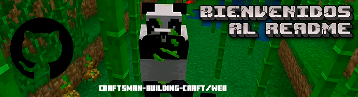

# 🛠️ Craftsman Building Craft Web

**El centro definitivo y hecho por la comunidad para expandir tu experiencia en Craftsman: Building Craft.**

## ✨ Descripción del Proyecto

Este sitio web nace de la necesidad de un punto centralizado para la vasta y creativa comunidad de **Craftsman: Building Craft**. Nuestro objetivo es simplificar la búsqueda de contenido valioso al reunir:

* **APKs Modificados:** Una colección organizada de versiones modificadas del juego creadas por la comunidad.
* **Lista Abierta de Servidores (Servers):** Un directorio donde los usuarios pueden listar y descubrir nuevos mundos para jugar.
* **Tutoriales y Consejos:** Un apartado dedicado a guías, trucos y consejos para mejorar la jugabilidad y la experiencia del usuario.

**Motivación:** Creamos este proyecto para llenar el vacío de un único sitio que reuniera toda esta información esencial. Queremos hacer que la búsqueda y el acceso al contenido de Craftsman sea lo más sencillo posible para todos.

## 🚧 Estado del Proyecto

El proyecto se encuentra actualmente en **fase de desarrollo activo**. Estamos mejorando la interfaz, ampliando el contenido y estamos **abiertos a sugerencias** y feedback de la comunidad para crecer juntos.

## 💻 Tecnologías Utilizadas

Este sitio web ha sido construido utilizando tecnologías estándar y robustas para garantizar accesibilidad y velocidad:

* **HTML5:** Para la estructura de todo el contenido.
* **CSS3:** Para el diseño y la presentación visual.

## 🚀 Guía de Inicio

Dado que este es un sitio web estático (HTML y CSS puro), no necesitas instalar dependencias ni ejecutar comandos complejos para verlo.

### 🌐 Acceder a la Web

Simplemente abre el archivo principal (`index.html`) en tu navegador o visita el enlace de despliegue si ya tienes el sitio publicado.

### ⚙️ Estructura del Repositorio

Puedes explorar los archivos de diseño (`.css`) y contenido (`.html`) para ver cómo está construido el proyecto.

## 🤝 Contribuciones y Agradecimientos

Agradecemos profundamente a **todos los creadores y miembros de la comunidad** que han hecho posible este proyecto con sus *mods*, *servidores* y *tutoriales*.

¡Tus ideas son importantes! Si tienes sugerencias para nuevas secciones, mejoras de diseño o contenido que te gustaría ver, no dudes en contactarme.

## 📬 Contacto del Desarrollador

Si tienes preguntas, comentarios o quieres colaborar, puedes contactarme directamente:

* **Email:** xx.diegoperez@gmail.com

## ⚖️ Licencia

Este proyecto está bajo la Licencia **MIT**. Consulta la sección a continuación para más detalles.
